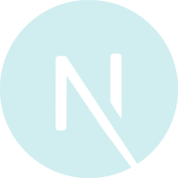
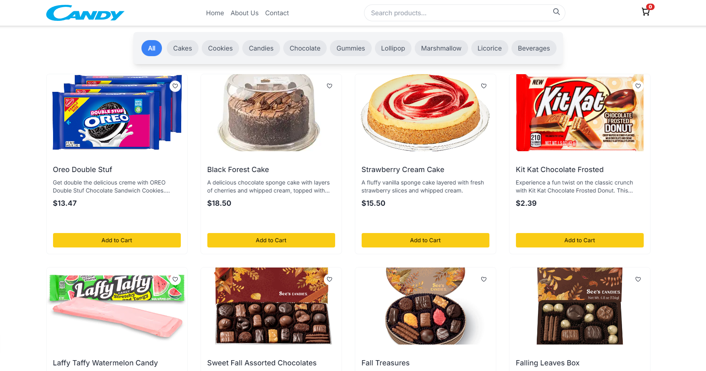
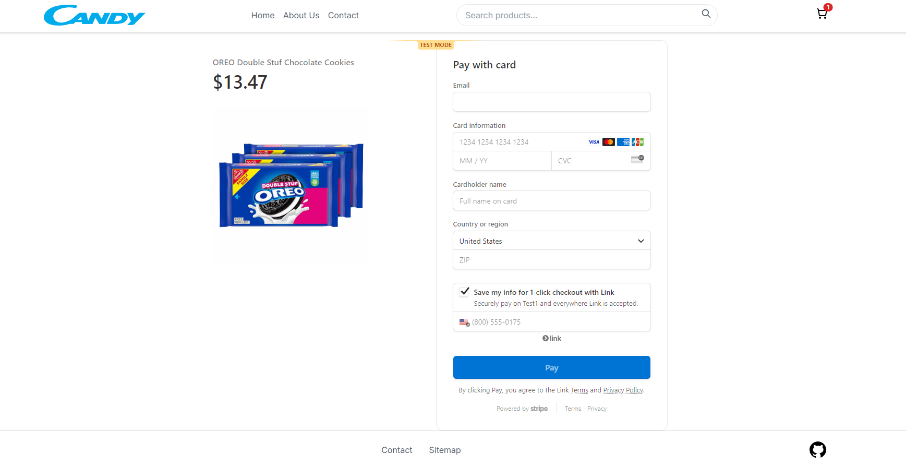
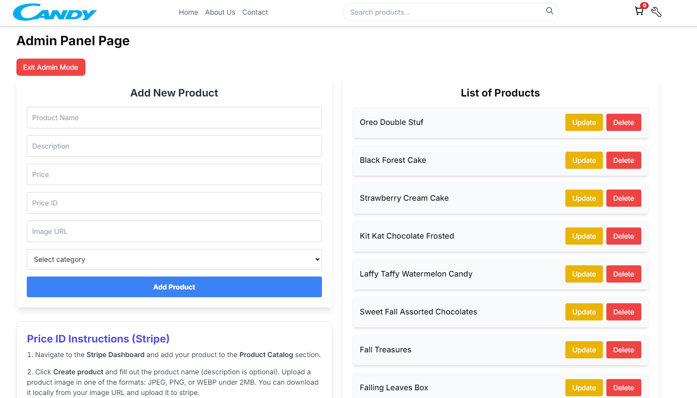
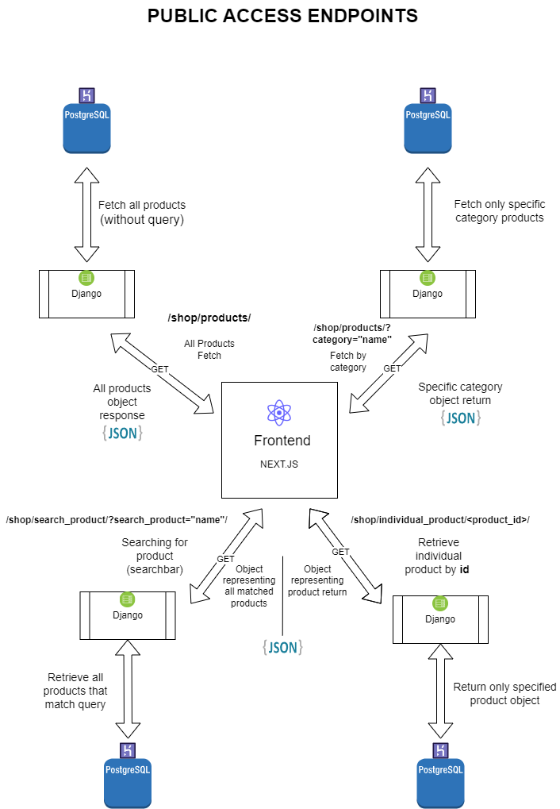
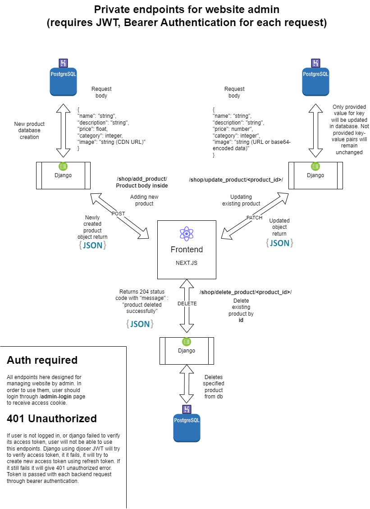

# Candy Shop  
## E-commerce website

I built **CandyShop** as a personal project to showcase the latest web technologies like Next.js and React. I made sure to follow best practices so that this app could be friendly and secure for both customers and website owners.

## Features

CandyShop functions as a full-fledged e-commerce platform designed for both customers and administrators. It allows users to browse products, add them to the cart, and securely check out using Stripe for payments. Website owners have access to admin panel where they can manage products displayed on the site. This website can be expanded as the site owner wants, React components allows to scale the site well and conveniently manage it.

### General Features:
- **User**: Browse, search, and purchase products (chocolates, cakes, beverages, and more). Can filter by categories.
- **Admin**: Add, update, delete products. Including Stripe integration.
- **Checkout**: Secure payments through Stripe API.
- **Responsive Design**: Responsive design for mobile and desktop apps.

## Technologies Used

The project uses several modern technologies:

- **Backend**: Built with Django and connected to a PostgreSQL database hosted on Heroku.
- **Frontend**: Next.js for server-side rendering, styles by Tailwind CSS, with Framer Motion for some animations.
- **API Requests**: Axios in some components for smooth data interactions.
- **State Management**: Redux for global state management.
- **Payments**: Stripe for secure transactions for checkout.

### Tech Stack Icons

   
  
  
   
   
  
  
  
  

## Backend
Backend code in GitHub repository:

- [Backend GitHub Repository](https://github.com/Candy-Shop-Project/candy-shop-backend)

## Screenshots

### Main Page

### Checkout Page

### Admin Panel

## API Endpoints

### Public Access Endpoints
These endpoints are accessible without authentication.

- **GET /shop/products/**: Retrieve all products, with optional category filtering.
- **GET /shop/individual_product/<product_id>/**: Retrieve object of a specific product by its ID.
- **GET /shop/search_product/**: Search for products by name.
- **POST /shop/get_multiple_products/**: Retrieve multiple products by providing a list of product IDs in request body. (not included in diagram)
- **POST /auth/jwt/create/**: Log in and obtain JWT access token.
- **POST /auth/jwt/refresh/**: Refresh JWT access token. (with current access token in body of request)
- **POST /auth/jwt/verify/**: Verify JWT token. (with current access token in body of request)

### Private Access Endpoints
These endpoints require authentication for managing products and categories.

- **POST /shop/add_product/**: Add a new product.
- **PATCH /shop/update_product/<product_id>/**: Update an existing product with product ID.
- **DELETE /shop/delete_product/<product_id>/**: Delete a product by ID.
- **POST /shop/add_category/**: Add a new category. (not included in diagram, include: "name" : "Category Name" in request body to crete new category, use Heroku DataClips to check to what ID it was assigned. Logic could be implemented in AdminPanel page for easier use) 

> **Note**: Other endpoints that require authentication:
- **POST /auth/users/**: Create a new user (restricted to authenticated users who are admins).

## License

This is a personal project to show modern web technologies in action. If for some reason you need to use this code for commercial purposes, please contact me: **tbudahov@gmail.com**. Thank you.
